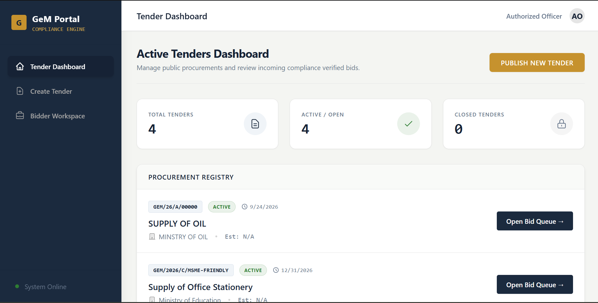
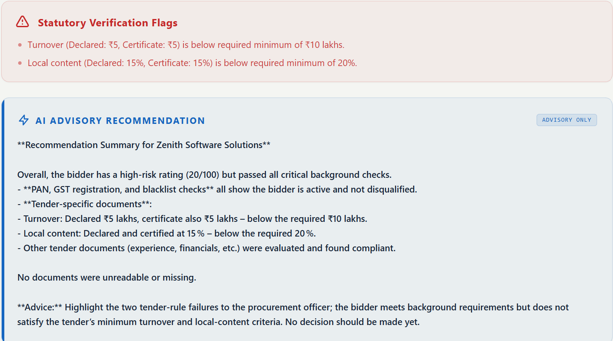

# 🏛️ AI-Powered Integrated Bid Compliance Verification Platform
> **Smart India Hackathon 2026** | **Problem Statement:** SIH26100 | **Team:** Heisenbugs


An enterprise-grade, Human-in-the-Loop (HITL) platform built for Government e-Marketplace (GeM) procurement officers. This system is designed to significantly reduce manual verification effort and accelerate tender evaluation using AI OCR, semantic extraction, dynamic rule engines, and cross-registry validation to flag fraud and discrepancies.

---

## 🎯 Problem
Manual verification of bidder eligibility documents can be time-consuming, error-prone, and difficult to audit. Procurement officers must verify multiple complex documents (like OEM authorizations and Turnover certificates) and cross-check information across different government registries manually.

## 💡 Our Solution
The platform automates document extraction, cross-field validation, registry verification, tender-rule evaluation, and risk scoring while keeping the final decision strictly with a human procurement officer.

---

## ✨ Key Features

- **🧠 Explainable AI Advisory:** Powered by Groq's ultra-low latency LLM inference, the system doesn't just score bidders—it provides a plain-English, evidence-backed summary of *why* they passed or failed.
- **🔍 Cross-Field Consistency Engine:** Automatically cross-references extracted OCR data (PAN, GST, EPFO) against simulated or live government databases to detect sophisticated fraud and name mismatches.
- **📜 Dynamic Tender Rule Engine:** Automatically reads tender eligibility requirements (e.g., Minimum Turnover, Make in India %, MSME exemptions) and runs extracted vendor data against those exact thresholds.
- **🏢 Synthetic Mock Registries:** Built-in offline sandboxing for restricted government APIs (MCA21, EPFO). Easily switchable to live APIs (like RapidAPI GST) via a central configuration switch.
- **🔒 Comprehensive Audit Trail:** Every single API check, AI extraction, and human decision is permanently recorded with timestamps, supporting transparency and auditability aligned with procurement requirements.

---

## 📸 Screenshots

### Dashboard


### AI Advisory & Bid Analysis

---

## 🛠️ Tech Stack

### Frontend
- React 19 (Vite)
- Tailwind CSS
- React Router DOM

### Backend
- Node.js & Express
- MongoDB & Mongoose
- Tesseract.js & pdf-parse (OCR & Document Extraction)
- Groq SDK (Llama/Mixtral Inference)
- RapidAPI (Live GST Status Network)

---

## 🚀 Getting Started

### Prerequisites
- [Node.js](https://nodejs.org/) (v18 or higher)
- [MongoDB](https://www.mongodb.com/) (Local or Atlas URI)

### 1. Clone the repository
```bash

git clone https://github.com/LikWeed-ctrl/gem-compliance-platform
cd gem-compliance-platform
```

### 2. Backend Setup
```bash
cd backend
npm install
```
Create a `.env` file in the `backend/` directory:
```env
PORT=5000
MONGODB_URI=mongodb://localhost:27017/gem_compliance
GROQ_API_KEY=your_groq_api_key_here
RAPIDAPI_KEY=your_rapidapi_key_here
RAPIDAPI_GST_HOST=gst-return-status.p.rapidapi.com
```
Seed the database with mock synthetic companies & tenders:
```bash
npm run seed  # (Ensure you run your specific seed script if different)
```
Start the backend server:
```bash
npm run dev
```

### 3. Frontend Setup
Open a new terminal window:
```bash
cd frontend
npm install
npm run dev
```
The application will be available at `http://localhost:5173`.

---

## 🏗️ Architecture Workflow

1. **Document Upload:** Vendor applies to a tender and uploads unstructured PDFs (OEM certificates, Turnover, Make In India declarations).
2. **OCR Extraction:** `Tesseract.js` and `pdf-parse` extract the raw text.
3. **Semantic Analysis:** Groq LLM structures the text and identifies key fields (UDINs, percentages, IDs).
4. **API Cross-Check:** The data is run against live (RapidAPI) or mock (Udyam, MCA21) registries.
5. **Rule Engine:** The data is strictly evaluated against the specific Tender's eligibility requirements.
6. **Scoring & Risk:** A compliance score (0-100) and Risk Level (Low/Medium/High) is assigned. Fatal errors (Blacklisted, Cancelled GST) trigger an instant score penalty.
7. **Human Decision:** The Procurement Officer reviews the AI Advisory, makes the final call, and a comprehensive log is saved.

---

## 🤝 Team Heisenbugs
Built with ❤️ for the **Smart India Hackathon 2026**.

*Note: This repository contains synthetic mock data generated strictly for demonstration and testing purposes during the hackathon.*
